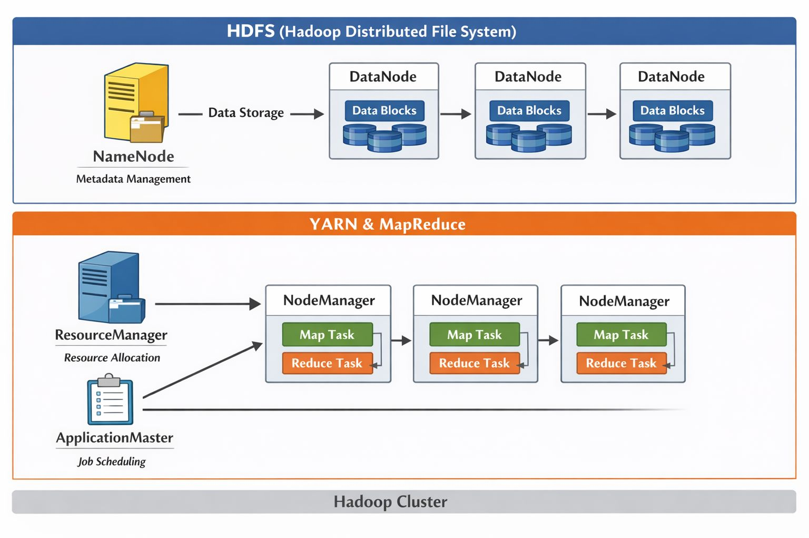
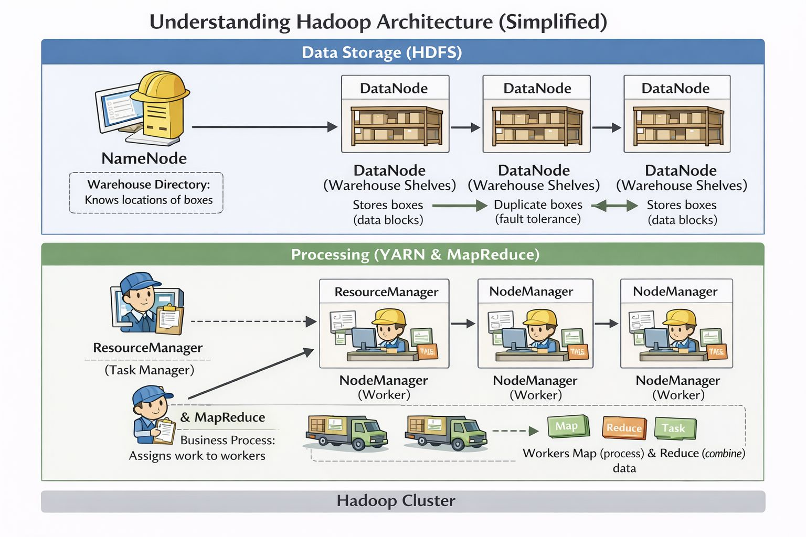

# Big Data Series (Part 1/xx): Introduction to Hadoop

Big Data technologies address the challenge of big data by enabling scalable, fault-tolerant data storage and computation. This series begins with Hadoop, one of the foundational frameworks in the Big Data ecosystem.

## What is Hadoop?

An open-source framework designed to store and process large volumes of structured and unstructured data across distributed systems.

### Key Words:
1. Commodity Hardware: PCs/VMs used to make clusters
2. Cluster: A group of interconnected machines working together as a single system.
3. Node: A single instance of a computer/VM
4. Distributed System: A system composed of multiple autonomous computers that communicate through a network. 

### Key Components of Hadoop

Hadoop Distributed File System (HDFS): Data Storage System. Provides reliable, distributed storage with data replication for fault tolerance. Stores files by splitting them into blocks across multiple DataNodes.

YARN (Yet Another Resource Negotiator): Manages cluster resources and schedules jobs efficiently.

MapReduce: A customizable framework for parallel data processing across nodes. User defined map and reduce phase - The map phase processes input data into key-value pairs, and the reduce phase aggregates and summarizes the results.

### Architecture: 
1. Master Node
 a. NameNode - Central File system manager. Remembers size of file, what pushed the file, blocks of file this is broken down into. Where the files reside etc. One stop shop - to understand where files are located. 
 b. ResourceManager: Allocates cluster resources and schedules applications.
2. Slave Node (Background nodes/workers)
 a. DataNodes - Machine where files/data are stored and processed. Communicates to main node by sending heartbeat signals. 
 b. NodeManager: Executes tasks and reports resource usage to the ResourceManager.

### Big Picture Flow 
1. Data is stored in HDFS (split across machines).
2. A job is submitted.
3. YARN assigns work close to where the data lives. 
4. MapReduce processes data in parallel. 
5. Results are written back to HDFS. 

### Why Hadoop Matters
1. Enables horizontal scalability using commodity hardware
2. Designed for high fault tolerance and data locality
3. Forms the backbone of many modern Big Data architectures

In the next part of this series, we will explore HDFS in greater detail and understand how distributed storage is implemented at scale.
