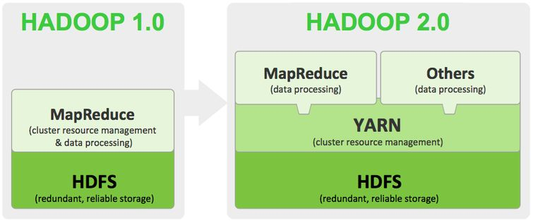
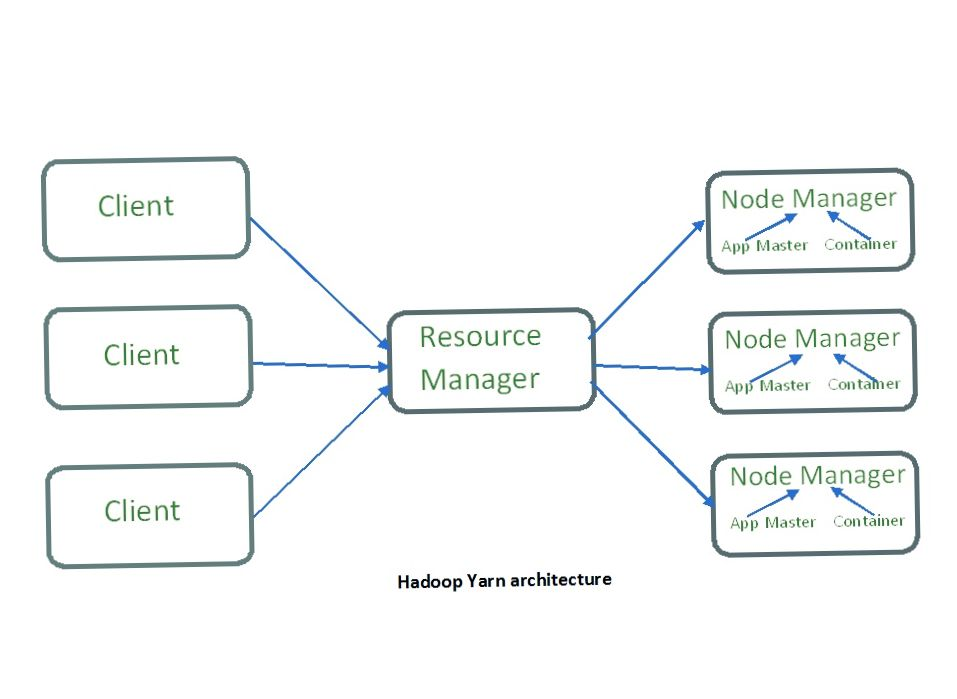

# Big Data Series (Part 3/x): YARN and Cluster Resource Management
In the previous parts of this series, we explored Hadoop and HDFS as the storage foundation of Big Data systems. In this section, we introduce YARN (Yet Another Resource Negotiator), the component that brought true cluster-wide resource management to Hadoop.

## Why YARN?
Hadoop1.x tightly coupled resource management and job execution through MapReduce. This limited scalability and flexibility, while also limiting to 4000 nodes.
Hadoop 2.x - YARN decouples these responsibilities, allowing multiple processing frameworks, such as MapReduce and Apache Spark. Now they are able to run efficiently on the same cluster, while also expanding the limit to 10000 nodes. The increase in nodes helps to support a diverse workload.

## What is YARN?
YARN is Hadoop’s cluster resource management layer. Responsible for:
1. Allocating CPU and memory resources
2. Scheduling applications
3. Monitoring execution across the cluster
YARN does not process data itself; it manages how and where processing happens.

### Core Components of YARN
1. ResourceManager (Master)
The ResourceManager runs on the master node and is the central authority for resource allocation.
It consists of two key sub-components:
a. Scheduler
Allocates resources to applications
Operates purely on resource availability
Does not track application state
b. ApplicationsManager
Accepts job submissions
Negotiates the first container for each application
Monitors application lifecycle

### 2. NodeManager (Worker)
The NodeManager runs on each worker (slave) node.
Responsibilities include:
i) Managing containers on the node
ii) Monitoring resource usage (CPU, memory)
iii) Reporting node health to the ResourceManager
NodeManagers typically run alongside DataNodes, enabling data-local execution.

### Advantages with YARN: 
1. Enables multiple processing engines (MapReduce, Spark, etc.)
2. Improves scalability and cluster utilization
3. Separates resource management from execution logic

In the next part of this series, we will explore MapReduce, and how YARN enables it within the Hadoop ecosystem.
Happy New Year 🎆 🎆 🎆 and more Big Data content coming soon!!!