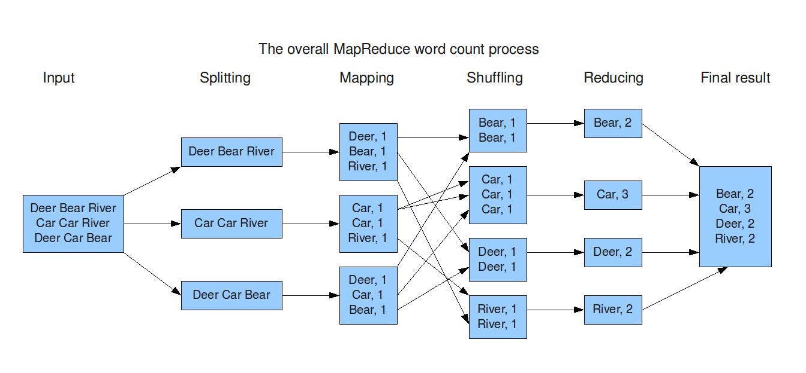

# Big Data Series (Part 4/x): Understanding MapReduce

In the previous part of this series, we introduced YARN and how it enables scalable resource management in Hadoop. In this section, we focus on MapReduce, and how it made Hadoop capable of large-scale parallel computation.

## What is MapReduce?

It is a distributed data processing framework that allows large datasets to be processed in parallel across multiple nodes in a cluster.

### Two Key Components to MapReuce:

1. Map: Process input data and emit intermediate key-value pairs

2. Reduce: Aggregate and summarize values associated with the same key

MapReduce is designed to work efficiently with HDFS!!!

### Why MapReduce Works Well at Scale

Massive Parallelism - Processes data in parallel across many nodes

Fault Tolerance - Automatically handles task distribution and fault tolerance

Data Locality - MapReduce runs where the data lives. Scales horizontally with the size of the cluster

Optimized for batch processing of large datasets

### MapReduce Execution Flow

1. Input data is read from HDFS and split into blocks

2. Map tasks process input splits and emit key-value pairs

3. Intermediate data is shuffled and sorted by key

4. Reduce tasks aggregate values for each key

5. Output is written back to HDFS

This model allows thousands of tasks to run concurrently.

Example:
You have 1 TB of web server logs stored in HDFS and want to count how many times each URL was accessed.
On a single machine without map reduce:

- Reading 1 TB sequentially takes hours

- CPU and memory become bottlenecks

- Failure means restarting the entire job

- MapReduce solves this by breaking the work into parallel tasks.

With Map reduce (Refer to Diagram for further understanding):

1. Data Splitting (HDFS)
 - The 1 TB file is split into 64 MB blocks
 - Each block is stored across different DataNodes
Example:
1 TB ≈ 16,000 blocks
These blocks are distributed across hundreds or thousands of nodes
2. Map Phase (Parallel Processing)
Each block processed independently and in parallel. 
3. Shuffle and Sort
Hadoop groups all values by key
4. Reduce Phase (Aggregation)
Reducers aggregate results

### Limitations of MapReduce and Not efficient for:

- Writes intermediate results to disk

- High latency due to disk I/O

- Iterative algorithms

- Interactive queries

- Real-time analytics

These limitations directly led to Apache Spark. 

In the next part of this series, we will explore Apache Spark, why it emerged, and how it improves upon MapReduce.
