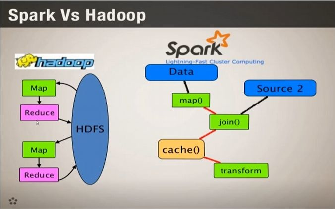
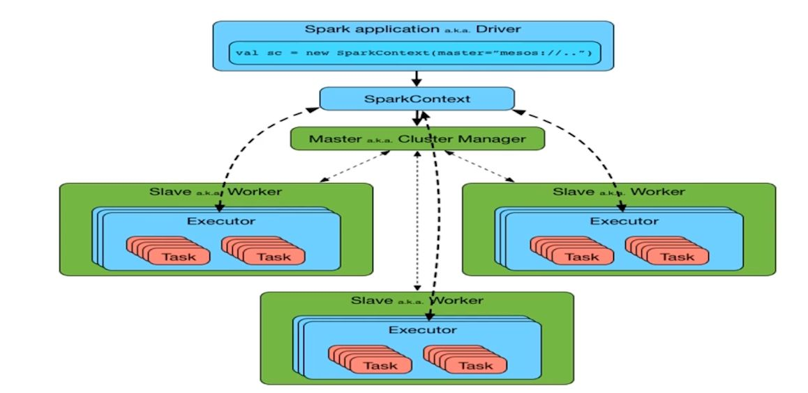

# Big Data Series (Part 5/x): Apache Spark

In the previous part of this series, we examined MapReduce and its role in large-scale batch processing. In this section, we look at Apache Spark, a parallel data processing framework designed to address the performance and limitations of Hadoop MapReduce.

## Why Spark?
While Hadoop MapReduce enabled scalable batch processing, it introduced several limitations:
- High latency due to disk-based intermediate writes
- Inefficiency for iterative algorithms and interactive workloads
- Limited support for advanced analytics

## What is Spark?
Apache Spark is an open-source, distributed, parallel processing framework designed for fast and flexible large-scale data processing.
Key characteristics:
- Supports in-memory computation
- Optimized for batch, streaming, and iterative workloads
- Integrates seamlessly with HDFS and YARN
- Typically provides 3x–10x performance improvements over Hadoop

## Hadoop vs Spark: Execution Architecture

### Hadoop (MapReduce on YARN)
Job Client ---> Name Nod ---> Resource Manager/YARN ---> Data Nodes
- The job is submitted by the user
- Metadata is resolved via the NameNode
- The ResourceManager schedules execution
- MapReduce tasks run in parallel on DataNodes
- Intermediate results are written to disk

### Spark Architecture

Driver
 → Cluster Manager
 → Worker Nodes (Executors)

1) Driver - i) Entry point of the Spark application,
 ii)Creates SparkContext
 iii)Coordinates task execution throughout job lifecycle
2) Cluster Manager - i) Responsible for resource allocation and scheduling
 ii)Comparable to YARN’s ResourceManager
 iii)Can be YARN, Mesos, or Spark Standalone
3) Worker Nodes - i) Equivalent to Hadoop DataNodes
 ii)Execute tasks in parallel
4) Executors - i) Run on worker nodes
 ii)Perform computations and store intermediate data in memory
 iii)Comparable to NodeManagers (Hadoop 2.x) or TaskTrackers (Hadoop 1.x)

### Spark Deployment Modes
1) Local Mode - Runs in a single JVM, Used for learning and development
2) Standalone Mode - Simple cluster setup, Suitable for learning and small-scale environments
3) Cluster Mode - Production-ready, Uses YARN or Mesos as the cluster manager. If Hadoop is already deployed, YARN enables MapReduce and Spark to coexist. Mesos can offer lower scheduling overhead than YARN in some scenarios

### How Spark Solves MapReduce Limitations
1) Spark allows intermediate computation results to be cached in memory
2) Memory access is significantly faster than disk I/O
3) Caching and persistence are explicitly controlled by the developer
4) Spark is not fully in-memory, It falls back to disk when memory is insufficient.
5) Maintains fault tolerance through lineage-based re-computation.

In the next part of this series, we will dive deeper into Spark internals, including RDDs, transformations, actions, and execution flow.